# vpype-perspective

*vpype-perspective* is a [*vpype*](https://github.com/abey79/vpype) plug-in to bring your 2D artwork in 3D space and render it in perspective. This project both aims to be a usable tool enabling new creative possibilities, and educational material demonstrating advanced uses of *vpype* and 3D computer graphics math basics.   

 


## Installation

**Note**: *vpype-perspective* requires *vpype* 1.10 or later.

If you haven't already, install *vpype* by following the [installation instructions](https://vpype.readthedocs.io/en/latest/install.html).

You can ensure that *vpype* is up-to-date with the following command:

```bash
$ pipx upgrade vpype
```

Then, add *vpype-perspective* to your *vpype* installation:

```bash
$ pipx inject vpype git+https://github.com/abey79/vpype-perspective
```

Check that your install is successful:

```bash
$ vpype --version
$ vpype perspective --help
[...]
```


## Documentation

**Note**: the figures below have been created using *vpype-perspective*. The `.vpy` and corresponding `.svg` files are located in the [`examples/figures`](https://github.com/abey79/vpype-perspective/tree/master/examples/figures) directory of the present repo.

### Basic 3D layout

As starting point, the `perspective` command builds a 3D stack of layer. Each layer is a planar "quad" (flat, rectangular 3D surface) whose dimensions match the current page size (or, if it is undefined, the computed bounds of the geometries). The quads are aligned to the X and Y axes, and stacked along the Z axis. The Z position of each layer quad is determined by the corresponding layer ID, such that layer 1 lies at `z = 0` and consecutive layer IDs are spaced by `delta_z` (which defaults to 1cm). The z position of layer N is thus `z = (layer_ID - 1) * delta_z`. The `delta_z` value can be overridden by using the `pspread DELTAZ` command before any other *vpype-perspective* command. 

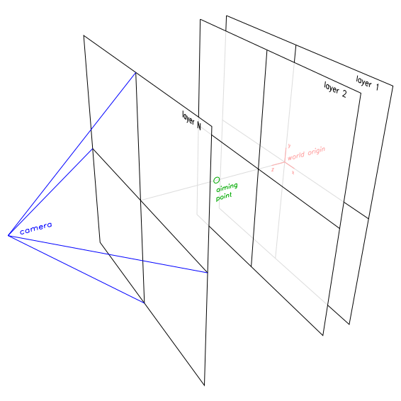

The `perspective` command uses a world coordinate system where the X axis points right (when facing a layer quad), the Y axis points up, and the Z axis is perpendicular to the layer quads and points in the direction of the layers with higher IDs. The origin of the world coordinate system thus lies in the middle of layer 1's quad. This is represented in red in the figures above.

Note that the X and Y axes of the world coordinate system do not match *vpype*'s native coordinate system. In the world coordinate system, (0, 0) is in the middle of the layer and the Y axis pointed upward, while in *vpype*'s coordinate system, (0, 0) is on the top-left corner of the layer and the Y axis is pointing downward.

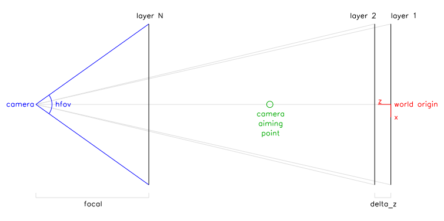

By default, the camera faces the front-most layer quad (highest layer ID/z value) and its aiming point is in the middle of the rectangular cuboid defined by the front-most layer and layer 1 (the default aiming point world coordinates are thus `(0, 0, (N-1) * delta_z / 2))` if N is the layer ID of the front-most layer). An alternative camera aiming point can be set using the `--aiming-point PX PY PZ` option.

The camera focal distance is chosen based on the desired horizontal field-of-view (which can be set using `--fov`). It is choose such that, will all default settings, the front-most layer is unchanged by the `perspective` command, and the other layers are increasingly scaled down the further they are. This can be demonstrated by the following command:

```
$ vpype \
    pagesize 10x10cm \
    repeat 5 \
        rect -l %_i+1% 0 0 10cm 10cm \
        text -l %_i+1% -p 0.1cm 0.2cm -s 12 "layer %_i+1%" \
    end \
    perspective --hfov 60 \
    show
```

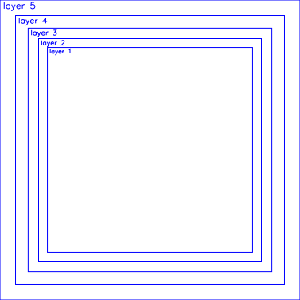

Using larger field-of-view yields stronger perspective distortion effects.

### Camera control

The position and orientation of the camera can easily be altered using the `--aiming-point`, `--pan`, `--tilt`, and `--move` options of the `perspective` command.

The `--pan` option orbits the camera right (for positive angles) or left (for negative angles) around the origin, while keeping pointed at it.

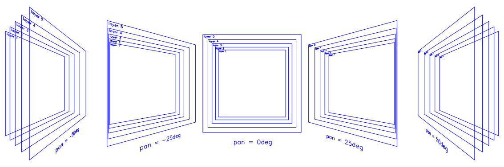

Likewise, the `--tilt` option orbits the camera up (for positive angles) and down (for negative angles) around the origin, again keeping pointed at it.

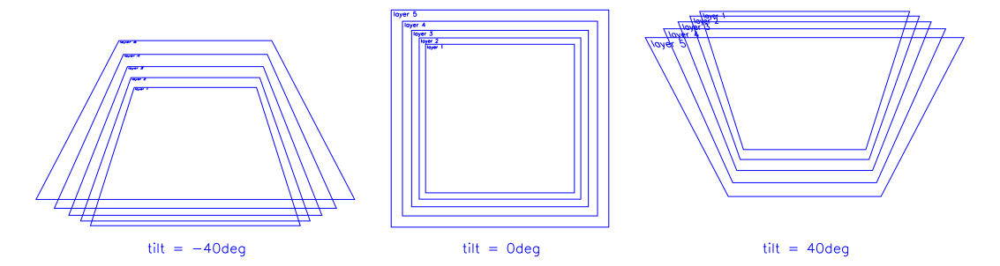

Finally, the `--move` option translate the camera in the provided X, Y, and Z direction.

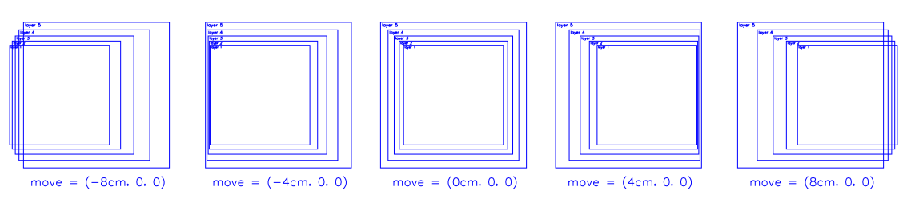

The camera translation is applied in the camera coordinate system, *after* the pan and tilt angles are applied (in this order). The order in which the options are passed to the `perspective` command *does not* affect the order in which they are applied. The following figure illustrate this order: 

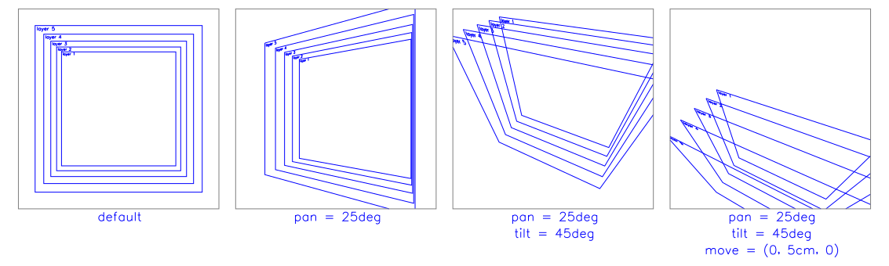

Note how, in the right-most example, the camera moved "over" the geometries. The camera was moved by 5cm in the Y ("up") direction *in the camera coordinate system". Since the camera pointing slightly downward due to the `--tilt` option, moving "up" in the camera coordinate system implies some forward horizontal displacement in the world coordinate system.


### Modifying layers

Each layer can be individually manipulated in the 3D space using the `pspread`, `protate`, `pscale`, and `ptranslate` commands. These commands operate by setting or modifying custom [properties](https://vpype.readthedocs.io/en/latest/fundamentals.html#properties). The `perspective` command then recognises these properties and apply the corresponding transforms to the geometry during the rendering process. The [`proplist`](https://vpype.readthedocs.io/en/latest/reference.html#proplist) command can be used to make this apparent:

```
$ vpype rect 0 0 10cm 15cm protate y 25 proplist --layer 1
listing 1 properties for layer 1
  prsp_transform: (ndarray) [[ 0.90630779  0.          0.42261826  0.        ]
 [ 0.          1.          0.          0.        ]
 [-0.42261826  0.          0.90630779  0.        ]
 [ 0.          0.          0.          1.        ]]
```

The `pspread` command overrides the default `delta_z` value and thus influences the positions of all layers but layer 1.

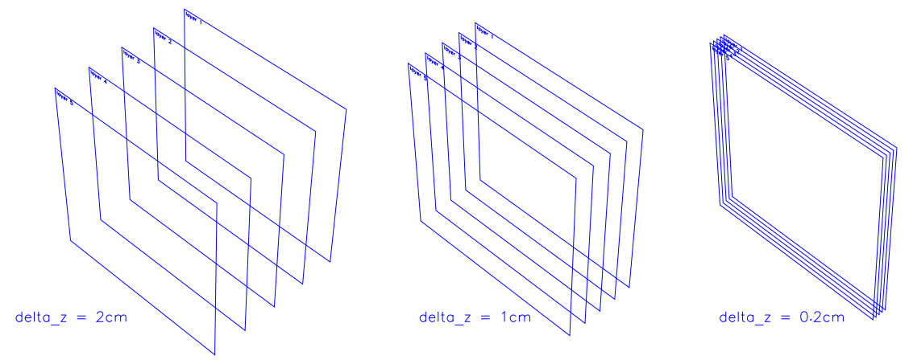

**Important**: `pspread` *must* be used *before* any other *vpype-perspective* command because they rely on the layer's position in space. 

The `protate` command rotates the layer quad around the X, Y, or Z axis (in world coordinate). By default (`--origin layer`), the rotation is applied around the layer quad's center. Using `--origin world`, the rotation is applied around the world origin instead.

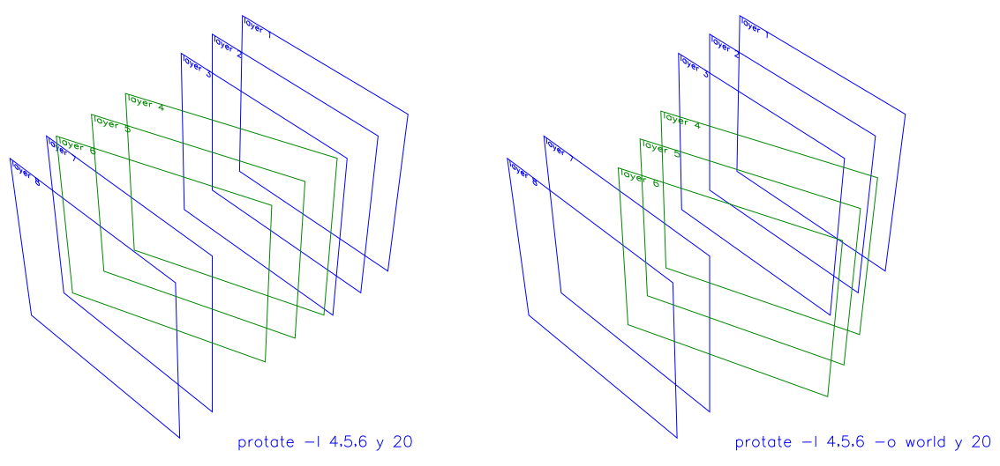

The `ptranslate` command translates the layer quad along the X, Y, and Z axis (in world coordinates). By default, the coordinates are considered offsets to be applied on the quad's current position. When using the `--absolute` option, the coordinates are instead considered as absolute values and the layer quad is translated such as its center lies on them.

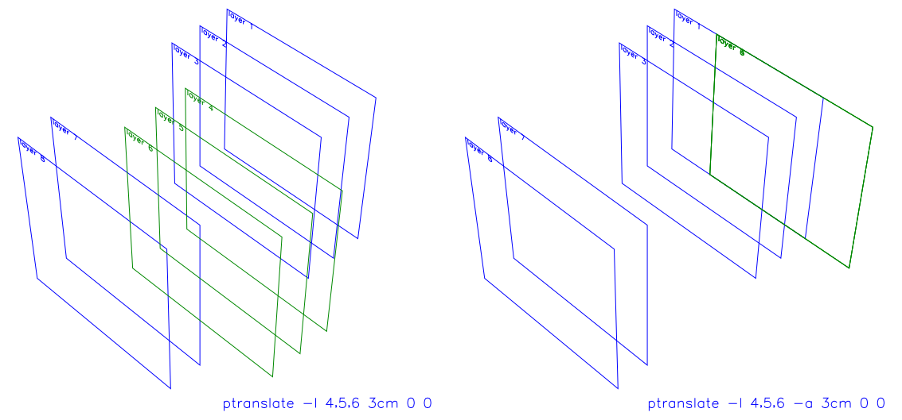

On the right side of the figure above, all three translated layer quads are superposed, with their center lying on the [3cm, 0, 0] world coordinates.

The `pscale` command scales the layer quad by a factors along the X, Y, and & axis (in world coordinates). By default (`--origin layer`), the scaling is applied around the layer quad's center. Using `--origin world`, the scaling is applied around the world coordinate origin instead.

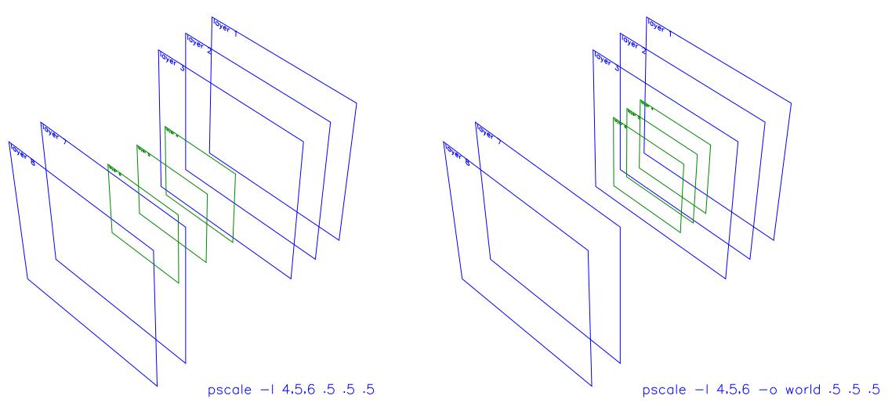

The commands may be chained to achieve complex transform of the layer quad.  

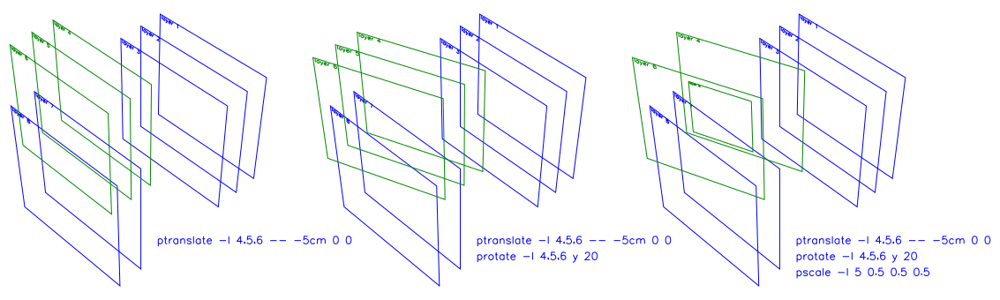

Finally, the `preset` command resets the transform currently applied.

## Development setup

Here is how to clone the project for development:

```bash
$ git clone https://github.com/abey79/vpype-perspective.git
$ cd vpype-perspective
```

Create a virtual environment:

```bash
$ python3 -m venv venv
$ source venv/bin/activate
$ pip install --upgrade pip
```

Install `vpype-perspective` and its dependencies (including `vpype`):

```bash
$ pip install -e .
$ pip install -r dev-dependencies.txt
```


## License

See the [LICENSE](LICENSE) file for details.
